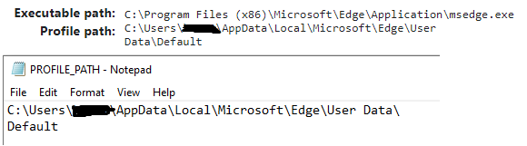

# bing-search-automation
This Python (3.8) automation tool uses Selenium for completing the Microsoft Rewards daily challenge.

## Getting Started
### Prerequisites

Download the right version browser driver for your [chrome browser](https://sites.google.com/a/chromium.org/chromedriver/home) or [edge browser](https://developer.microsoft.com/en-us/microsoft-edge/tools/webdriver/).  

Then install the Selenium library,

```
pip install selenium==4.0.0
```

#### Creating Essential search_key File
Create a `search_key` file which contains all the keywords (separated by newline) you want to search.

### Windows Edge Specific Instructions
#### Creating Essential PROFILE_PATH File

Create an empty text file and name it as `PROFILE_PATH` (without extension name).  



Copy and paste profile path to the `PROFILE_PATH` file. Then separate the profile path in two lines. `C:\Users\uname\AppData\Local\Microsoft\Edge\User Data\` prefix on the first line and whatever comes after on the second line as shown in the screenshot above.

### Running
#### General
```
python bing.py
```

#### Windows Edge
```
run.bat
```
or double clicking the `run.bat` batch file
