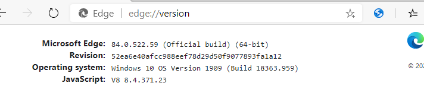
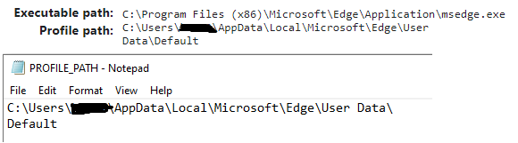

# bing-search-automation
The selenium python based automation tool is for completing the Microsoft Rewards daily challenge.
## Getting Started
### Prerequisites
Check edge browser version by entering edge://version in the browser search bar.

In this case, the edge browser version is 84.0.522.59
```
python --version
>> Python 3.8.5
```
If your edge version is different from above, please download and replace the msedgedriver.exe accordingly.
https://developer.microsoft.com/en-us/microsoft-edge/tools/webdriver/
### Installing dependencies and required libraries (in Windows cmd)
```
pip install selenium==4.0.0a5
```
### Creating Essential PROFILE_PATH File
Create an empty text file and name it as "PROFILE_PATH" (without extension name).

Copy and paste profile path to the PROFILE_PATH file. Then separate the profile path in two lines. "C:\Users\uname\AppData\Local\Microsoft\Edge\User Data\" prefix on the first line and whatever comes after on the second line as shown in the screenshot above.
### Running in cmd
```
python bing.py
```
or
```
run.bat
```
or double clicking the run.bat batch file
